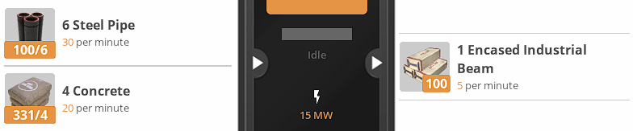

# Easy Alternative Recipes
_Keep it simple, ~~stupid~~ silly!_

**Beta Warning:** The recipe ratios may change based on feedback. Always read the changelogs!

This mod can be described as cheat by some, but perhaps a time-saver for others, the aim is to simplify the alternative recipe ratios without deviating too much.

To start using the new recipes, you must complete the milestones through your HUB. There's no need to unlock the original recipes.

### **Unlocked at Tier 3**

**Iron Alloy Ingot:**

**Copper Alloy Ingot:**

### **Unlocked at Tier 4**

**Encased Industrial Pipe:**

**Quickwire Stator:**

### **Unlocked at Tier 5**

**Pure Iron Ingot:**

**Pure Copper Ingot:**

**Recycled Plastic:**

**Recycled Rubber:**

 
If you find a bug or have an idea for new recipe ratios, please contact me through Satisfactory Modding Discord server (VoxTenebris#9999) or raise an issue on GitHub.

See the mod at [ficsit.app](https://ficsit.app/mod/3uhv2zfATu63Hi)

# Discord Server
Join the [discord server](https://discord.gg/satisfactorymodding) to talk about Satisfactory Modding in general.

# DISCLAIMER
This software is provided by the author "as is". In no event shall the author be liable for any direct, indirect, incidental, special, exemplary, or consequential damages (including, but not limited to procurement of substitute goods or services; loss of use, data, or profits; or business interruption) however caused and on any theory of liability, whether in contract, strict liability, or tort (including negligence or otherwise) arising in any way out of the use of this software, even if advised of the possibility of such damage.
