# Easy Alternative Recipes
_Keep it simple, ~~stupid~~ silly!_

---

**Beta Warning:** The recipe ratios may change based on feedback. Always read the changelogs!

This is an open-source mod (future-proof maybe?) that aims to simplify the alternate recipes and some late-game vanilla recipes while also increasing their efficiency. It can be described as a cheat mod by some, but perhaps it's a time-saver for others.

The mod adds 59 recipes, and to use it, a new research tree will be available in MAM, in which you must unlock its nodes. There's no requirement to have the original recipes.

**Available chat commands:**
 * `/easyalt_unlock` Unlocks all nodes in the research tree
 * `/easyalt_aluminum` Unlocks a recipe to produce Aluminum Ingots directly from Bauxite

If you find a bug or have an idea for new recipes, please contact me through [Satisfactory Modding](https://discord.gg/satisfactorymodding) Discord server (**VoxTenebris#9999**) or raise an issue on [GitHub](https://github.com/VoxTenebris/EasyAltRecipes/issues "GitHub Issue Page").

---

### **Unlocked at Tier 1**

**Cast Screw ➔ [Constructor]:**

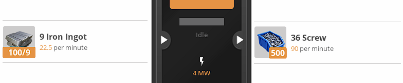

**Iron Wire ➔ [Constructor]:**

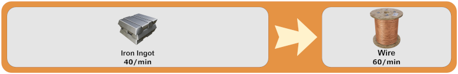

---

### **Unlocked at Tier 2**

**Copper Rotor ➔ [Assembler]:**

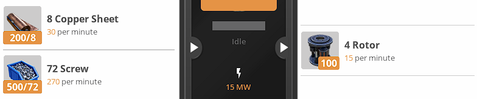

**Stitched Iron Plate ➔ [Assembler]:**

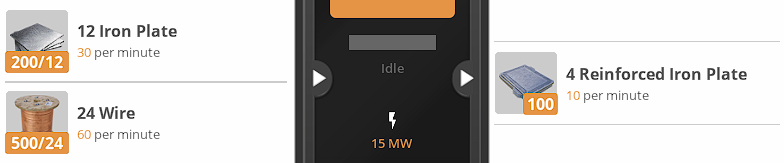

### **Unlocked at Tier 2: Silica**

**Cheap Silica ➔ [Assembler]:**

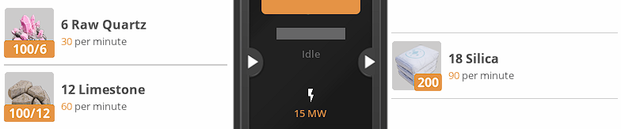

### **Unlocked at Tier 2: Bolted**

**Bolted Iron Plate ➔ [Assembler]:**

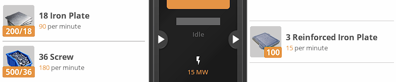

**Bolted Frame ➔ [Assembler]:**

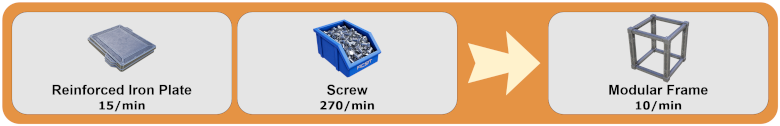

---

### **Unlocked at Tier 3**

**Iron Alloy Ingot ➔ [Foundry]:**

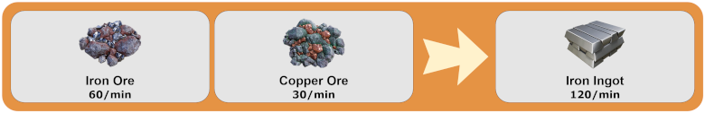

**Copper Alloy Ingot ➔ [Foundry]:**

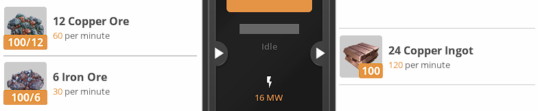

### **Unlocked at Tier 3: Wet Process**

**Steamed Copper Sheet ➔ [Refinery]:**

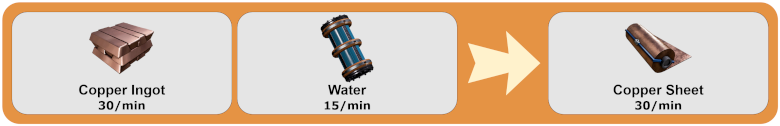

**Wet Concrete ➔ [Refinery]:**

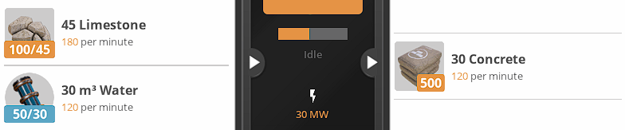

**Pure Quartz Crystal ➔ [Refinery]:**

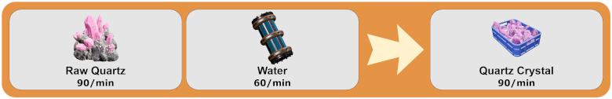

### **Unlocked at Tier 3: Steel & Coal**

**Steeled Frame ➔ [Assembler]:**

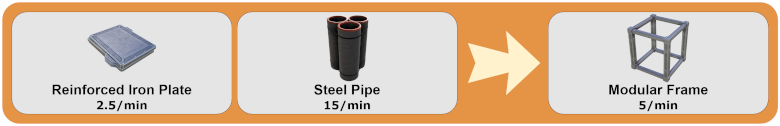

**Solid Steel Ingot ➔ [Foundry]:**

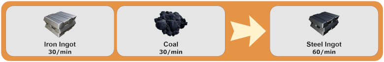

**Compacted Coal ➔ [Assembler]:**

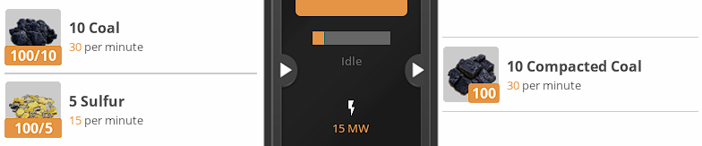

---

### **Unlocked at Tier 4**

**Encased Industrial Pipe ➔ [Assembler]:**

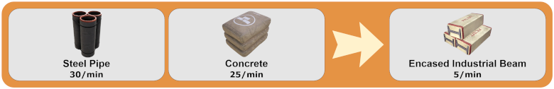

**Steel Screw ➔ [Constructor]:**

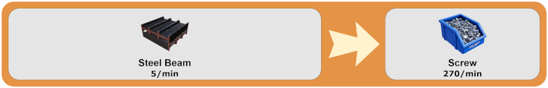

### **Unlocked at Tier 4: Quickwire**

**Fused Quickwire ➔ [Assembler]:**

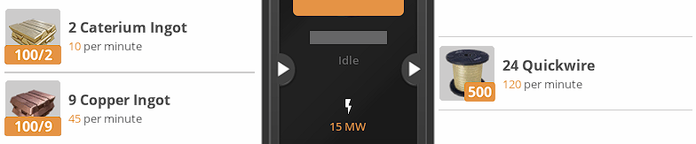

**Quickwire Stator ➔ [Assembler]:**

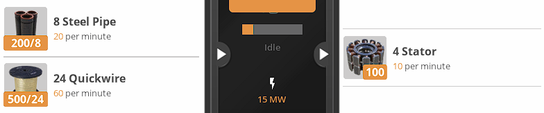

**AI Limiter ➔ [Assembler]:**

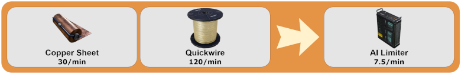

---

### **Unlocked at Tier 5**

**Recycled Plastic ➔ [Refinery]:**

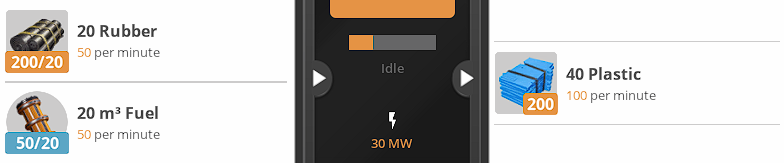

**Recycled Rubber ➔ [Refinery]:**

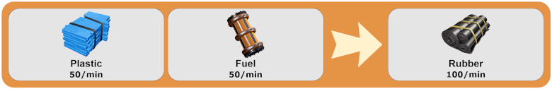

**Diluted Packaged Fuel ➔ [Refinery]:**

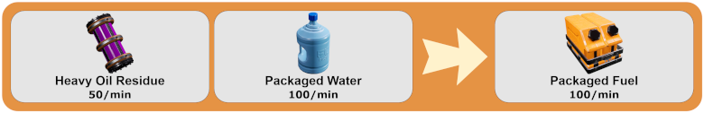

### **Unlocked at Tier 5: Oil Refinery**

**Turbofuel ➔ [Refinery]:**

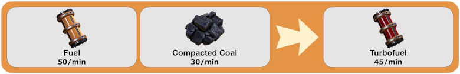

**Heavy Crude Oil ➔ [Refinery]:**

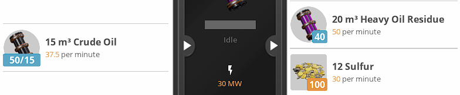

### **Unlocked at Tier 5: Silicons**

**Insulated Crystal Oscillator ➔ [Manufacturer]:**

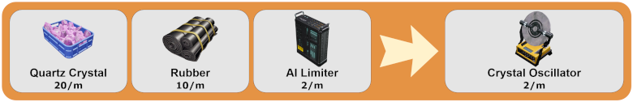

**Silicon Circuit Board ➔ [Assembler]:**

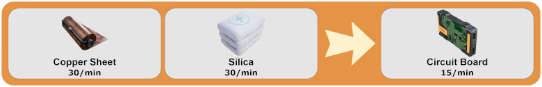

**Crystal Computer ➔ [Assembler]:**

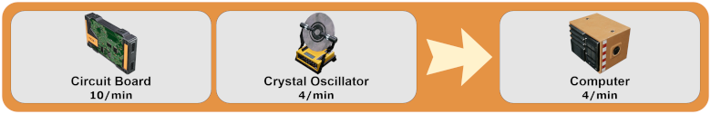

### **Unlocked at Tier 5: Pure Ingots**

**Pure Iron Ingot ➔ [Refinery]:**

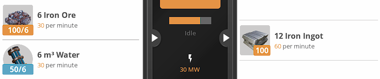

**Pure Copper Ingot ➔ [Refinery]:**

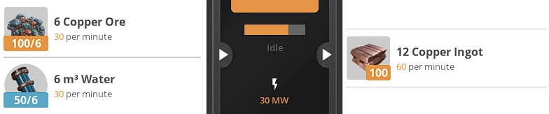

**Pure Caterium Ingot ➔ [Refinery]:**

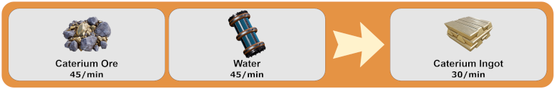

### **Unlocked at Tier 5: Heavy Caterium**

**Heavy Encased Frame ➔ [Manufacturer]:**

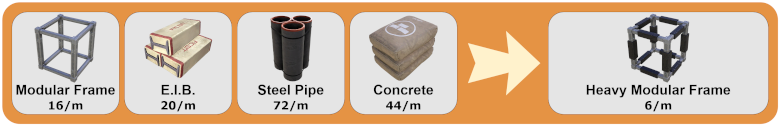

**Caterium Circuit Board ➔ [Assembler]:**

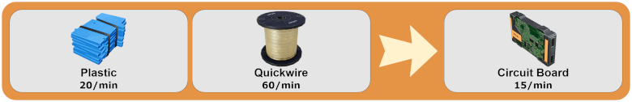

**Caterium Computer ➔ [Manufacturer]:**

### **Unlocked at Tier 5: High-Speed Computer**

**High-Speed Connector ➔ [Manufacturer]:**

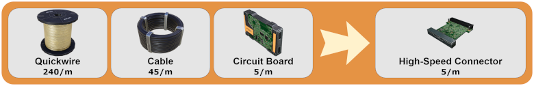

**Supercomputer ➔ [Manufacturer]:**

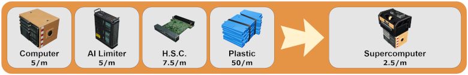

**Silicon High-Speed Connector ➔ [Manufacturer]:**

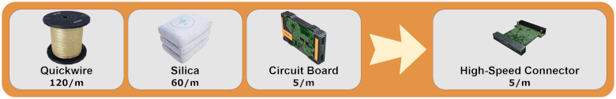

---

### **Unlocked at Tier 7: Alumina Refinery**

**Sloppy Alumina ➔ [Refinery]:**

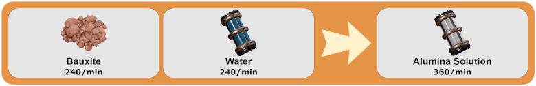

**Electrode - Aluminum Scrap ➔ [Refinery]:**

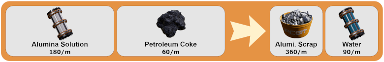

### **Unlocked at Tier 7: Aluminum Smelting**

**Aluminum Alloy Ingot ➔ [Foundry]:**

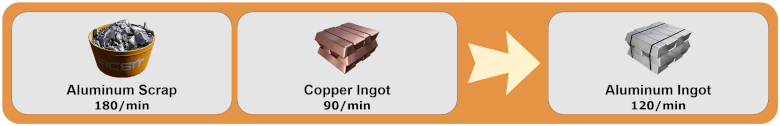

**Alclad Casing ➔ [Assembler]:**

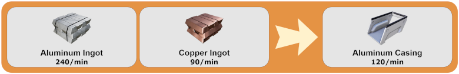

**Alclad Aluminum Sheet ➔ [Assembler]:**

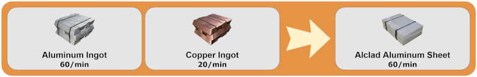

### **Unlocked at Tier 7: Radio Control**

**Radio Control Unit ➔ [Manufacturer]:**

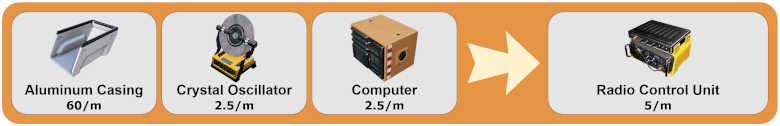

**Radio Control System ➔ [Manufacturer]:**

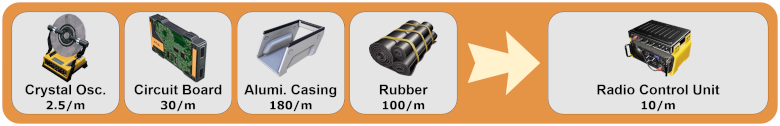

### **Unlocked at Tier 7: Blended Turbofuel**

**Turbo Blend Fuel ➔ [Blender]:**

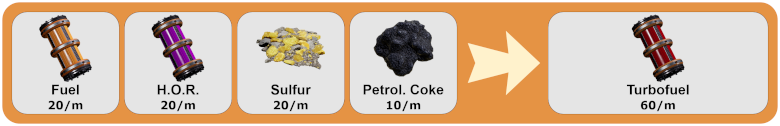

### **Unlocked at Tier 7: Sulfur Battery**

**Sulfuric Acid ➔ [Refinery]:**

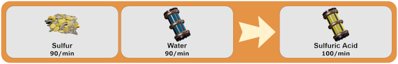

**Classic Battery ➔ [Manufacturer]:**

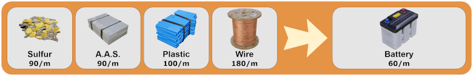

---

### **Unlocked at Tier 8: Heat Sink**

**Heat Sink ➔ [Assembler]:**

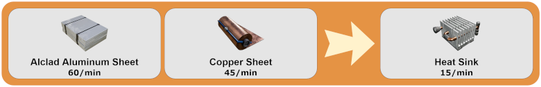

**Fused Modular Frame ➔ [Blender]:**

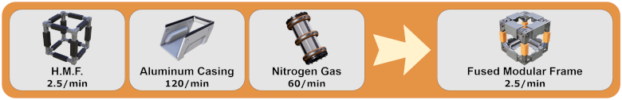

### **Unlocked at Tier 8: Turbo Computer**

**Turbo Motor ➔ [Manufacturer]:**

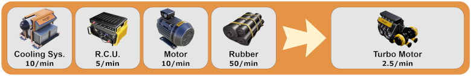

**Super-State Computer ➔ [Manufacturer]:**

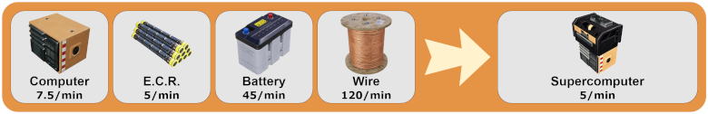

### **Unlocked at Tier 8: Cool Radio**

**Cooling System ➔ [Blender]:**

**Radio Connection Unit ➔ [Manufacturer]:**

### **Unlocked at Tier 8: Control Rods**

**Electromagnetic Control Rod ➔ [Assembler]:**

**Electromagnetic Connection Rod ➔ [Assembler]:**

### **Unlocked at Tier 8: Turbo Frame**

**Turbo Electric Motor ➔ [Manufacturer]:**

**Heat-Fused Frame ➔ [Blender]:**

### **Unlocked at Tier 8: Cool Motor**

**Cooling Device ➔ [Blender]:**

**Turbo Pressure Motor ➔ [Manufacturer]:**

---

### **Unlocked only via chat command**

**Skip: Aluminum Ingot ➔ [Smelter]:** `/easyalt_aluminum`

---

See the mod at [ficsit.app](https://ficsit.app/mod/3uhv2zfATu63Hi)

# Discord Server
Join the [discord server](https://discord.gg/satisfactorymodding) to talk about Satisfactory Modding in general.

# Thanks

* Coffee Stain Studios
* Mircea and co., which made this mod possible
* Nogg and Robb for their tree editor
* [AnthorNet](https://anthor.net/) for the items images on SCIM
* [Smashicons](https://www.flaticon.com/authors/smashicons) for the logo and in-game icon

# DISCLAIMER
This software is provided by the author "as is". In no event shall the author be liable for any direct, indirect, incidental, special, exemplary, or consequential damages (including, but not limited to procurement of substitute goods or services; loss of use, data, or profits; or business interruption) however caused and on any theory of liability, whether in contract, strict liability, or tort (including negligence or otherwise) arising in any way out of the use of this software, even if advised of the possibility of such damage.
