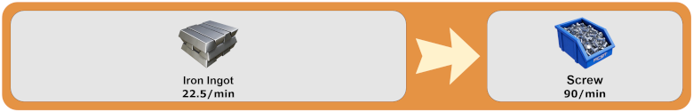
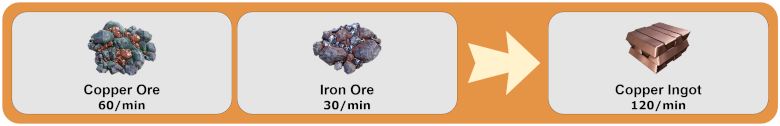
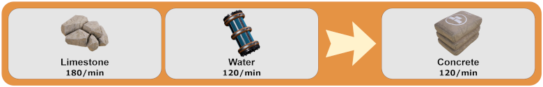
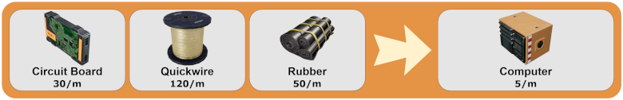

# Easy Alternative Recipes
_Keep it simple, ~~stupid~~ silly!_

---

**Beta Warning:** The recipe ratios may change based on feedback. Always read the changelogs!

This is an open-source mod that aims to simplify the alternate recipes and boost their efficiency. It can be described as a cheat mod by some, but perhaps it's a time-saver for others.

The mod adds 40 recipes, and to use it, a new research tree will be available in MAM, in which you must unlock its nodes. There's no requirement to have the original recipes.

If you find a bug or have an idea for new recipes, please contact me through [Satisfactory Modding](https://discord.gg/satisfactorymodding) Discord server (**VoxTenebris#9999**) or raise an issue on [GitHub](https://github.com/VoxTenebris/EasyAltRecipes/issues "GitHub Issue Page").

---
### **Unlocked at Tier 1**

**Cast Screw:**

**Iron Wire:**

---

### **Unlocked at Tier 2**

**Copper Rotor:**

**Stitched Iron Plate:**

### **Unlocked at Tier 2: Silica**

**Cheap Silica:**

### **Unlocked at Tier 2: Bolted**

**Bolted Iron Plate:**

**Bolted Frame:**

---

### **Unlocked at Tier 3**

**Iron Alloy Ingot:**

**Copper Alloy Ingot:**

### **Unlocked at Tier 3: Refinery**

**Steamed Copper Sheet:**

**Wet Concrete:**

**Pure Quartz Crystal:**

### **Unlocked at Tier 3: Steel & Coal**

**Solid Steel Ingot:**

**Compacted Coal:**

---

### **Unlocked at Tier 4**

**Encased Industrial Pipe:**

**Steel Screw:**

### **Unlocked at Tier 4: Quickwire**

**Fused Quickwire:**

**Quickwire Stator:**

---
### **Unlocked at Tier 5**

**Recycled Plastic:**

**Recycled Rubber:**

**Diluted Packaged Fuel:**

### **Unlocked at Tier 5: Oil Refinery**

**Turbofuel:**

**Heavy Crude Oil:**

### **Unlocked at Tier 5: Silicons**

**Insulated Crystal Oscillator:**

**Silicon Circuit Board:**

**Crystal Computer:**

### **Unlocked at Tier 5: Pure Ingots**

**Pure Iron Ingot:**

**Pure Copper Ingot:**

**Pure Caterium Ingot:**

### **Unlocked at Tier 5: Heavy Caterium**

**Heavy Encased Frame:**

**Caterium Circuit Board:**

**Caterium Computer:**

### **Unlocked at Tier 5: Advanced Computer**

**High-Speed Connector:**

**Silicon High-Speed Connector:**

**Supercomputer:**

### **Unlocked at Tier 7: Alumina Refinery**

**Sloppy Alumina:**

**Electrode - Aluminum Scrap:**

### **Unlocked at Tier 7: Aluminium Smelting**

**Aluminum Alloy Ingot:**

**Alclad Casing:**

**Alclad Aluminum Sheet:**

---

See the mod at [ficsit.app](https://ficsit.app/mod/3uhv2zfATu63Hi)

# Discord Server
Join the [discord server](https://discord.gg/satisfactorymodding) to talk about Satisfactory Modding in general.

# Thanks

* Coffee Stain Studios
* Mircea and co., which made this mod possible
* Nogg and Robb for their tree editor
* [AnthorNet](https://anthor.net/) for the items images on SCIM
* [Smashicons](https://www.flaticon.com/authors/smashicons) for the logo and in-game icon

# DISCLAIMER
This software is provided by the author "as is". In no event shall the author be liable for any direct, indirect, incidental, special, exemplary, or consequential damages (including, but not limited to procurement of substitute goods or services; loss of use, data, or profits; or business interruption) however caused and on any theory of liability, whether in contract, strict liability, or tort (including negligence or otherwise) arising in any way out of the use of this software, even if advised of the possibility of such damage.
